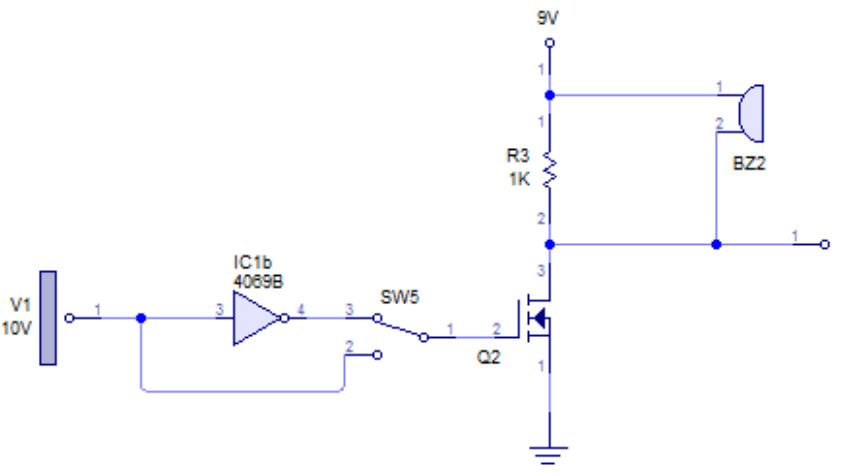
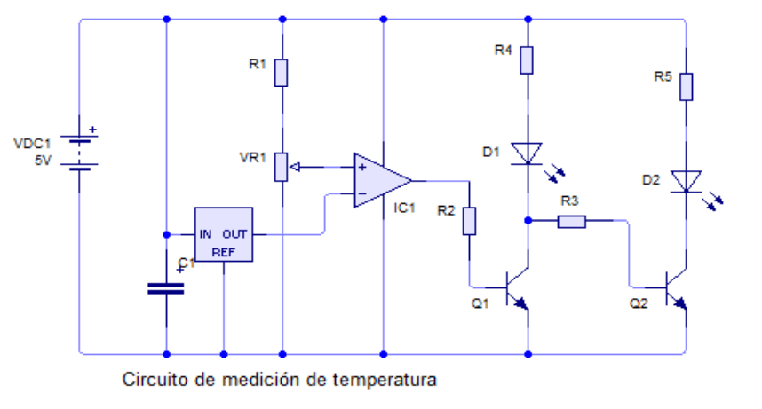
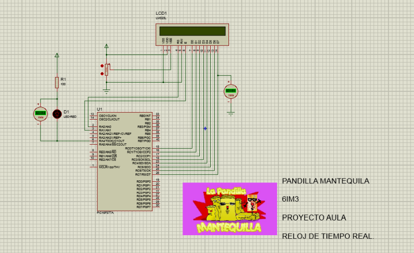
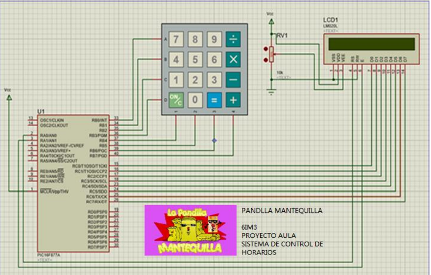
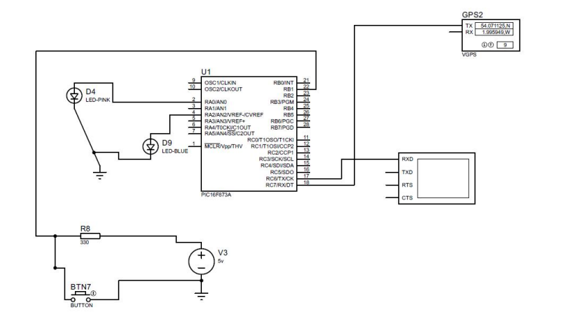
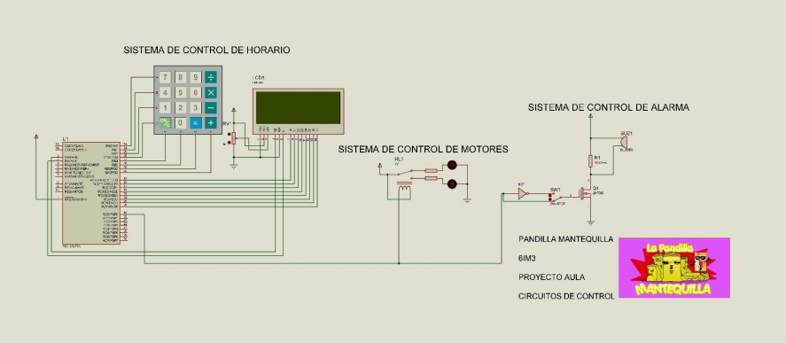

# ❤️‍🩹AUTOMATIC CAPSULE DISPENSER 💊

  <h4><strong>
    The ADC project stands for “Automatic Capsule Dispenser” which focuses on creating a pill dispenser that facilitates the needs of the consumer or patient in relation to the hours of consumption of these; including visual and auditory aids to improve the system's schedule notice.
  </h4></strong>
  

---

## S C H E M A T I C S

  <h3><strong>
    HORN CONTROL:
  </h3></strong>
  
  <h3><strong>
    TEMPERATURE CONTROL:
  </h3></strong>
  
  <h3><strong>
    REAL TIME CLOCK:
  </h3></strong>
  
  <h3><strong>
    SCHEDULE CONTROL:
  </h3></strong>
  
  <h3><strong>
    LOCATION:
  </h3></strong>
  
  <h3><strong>
    AUTOMATIC CAPSULE DISPENSER:
  </h3></strong>
  

---

## YT V I D E O ▶️:

- **[La Pandilla Mantequilla](https://www.youtube.com/watch?v=7wLfim5DCOw)**
