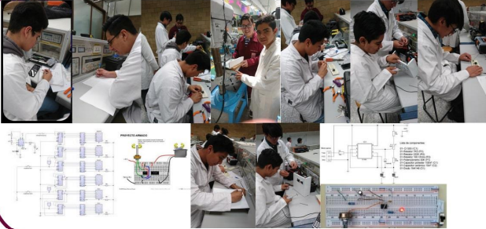

# ❤️‍🩹AUTOMATIC CAPSULE DISPENSER 💊

  <h4><strong>
    The ADC project stands for “Automatic Capsule Dispenser” which focuses on creating a pill dispenser that facilitates the needs of the consumer or patient in relation to the hours of consumption of these; including visual and auditory aids to improve the system's schedule notice.
  </h4></strong>
  

---

## D O C U M E N T S:

  <h3><strong>
   - <a href="ACD.pdf">Full Documentation in HD 4K 😎</a>
  </h3></strong> 
  <h3><strong>
   - <a href="https://github.com/PhilipSanM/Robotics_DigitalSystems_and_Cheese/tree/main/ACD/Code">-->CODE<--</a>
  </h3></strong> 

---

## T O O L S:

  <h3><strong>
   - <a href="https://www.microchip.com/en-us/tools-resources/develop/mplab-x-ide">ASSEMBLER MPLAB IDE</a>
  </h3></strong> 
  
  <h3><strong>
   - <a href="https://www.labcenter.com/">Proteus Design Suite</a>
  </h3></strong> 
  
  <h3><strong>
   - <a href="https://pic-c-compiler1.software.informer.com/versions/">Pic C Compiler</a>
  </h3></strong> 
  

---

## S C H E M A T I C S

  <h3><strong>
    - HORN CONTROL:
  </h3></strong>
  
  <h3><strong>
    - TEMPERATURE CONTROL:
  </h3></strong>
  
  <h3><strong>
    - REAL TIME CLOCK:
  </h3></strong>
  
  <h3><strong>
    - SCHEDULE CONTROL:
  </h3></strong>
  
  <h3><strong>
    - LOCATION:
  </h3></strong>
  
  <h3><strong>
    - AUTOMATIC CAPSULE DISPENSER:
  </h3></strong>
  

---

## YT V I D E O ▶️:

- **[La Pandilla Mantequilla](https://www.youtube.com/watch?v=7wLfim5DCOw)**
- **[CECyT 9 -ACD](https://www.youtube.com/watch?v=u54tylWNG8o)**
- **[CECyT 9 EXPOBATIZ](https://www.youtube.com/watch?v=XzQXxdGQ930)**
- **[ACD Place #1🏆](https://youtu.be/1DPNHHEn778?t=5077)**

---

  <h4><strong><i>
    This project was made with love 💖 by LA PANDILLA MANTEQUILLA.
  </h4></strong></i>
  

