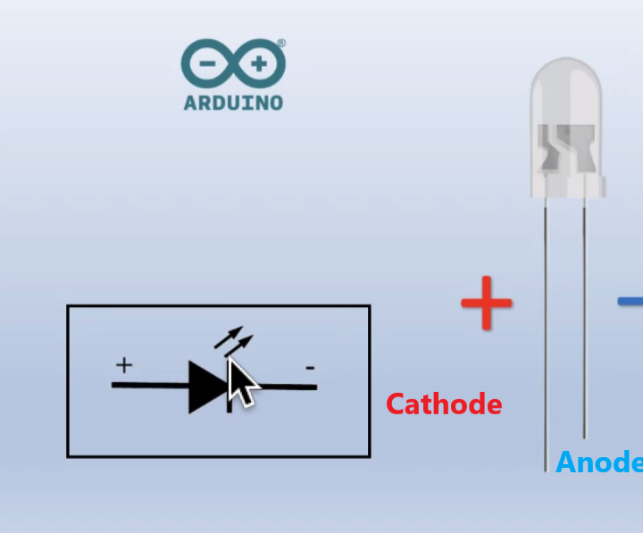

# 💡🚨LED 🚨💡

---

  <h3><strong>
    A light-emitting diode (LED)
  </h3></strong>
  

  

  Is a semiconductor light source that emits light when current flows through, remember that a diode is a a<strong> semiconductor device with two terminals, typically allowing the flow of current in one direction only.</strong> 
  

