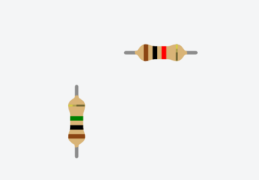

# 💡🚨RESISTOR 🚨💡

---

  <h3><strong>
    A resistor is a device having resistance to the passage of an electric current.
  </h3></strong>
  

  

  A resistor is a passive two-terminal electrical component that implements electrical resistance as a circuit element.
  

  

